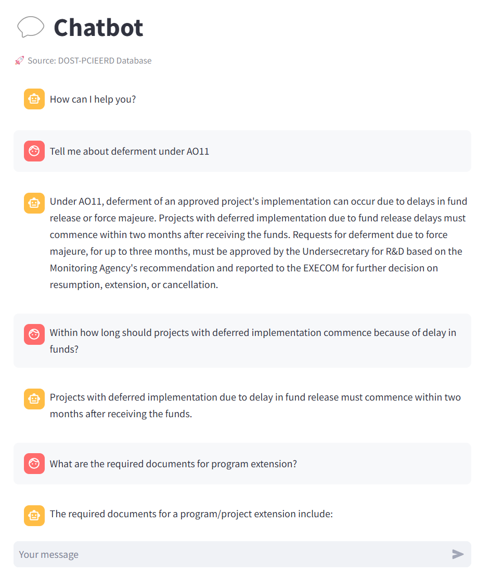

# Chat Assistant



regarding the backend interactions for the large language model:


| from scratch (langchain) | third party |
| --- | --- |

# But why??

- **from scratch:** more control and speed over using a third party solution

## Control:

- storage method - vector storage, graph storage
- retrieval method
- control the pre-processing and post processing of data
- fine tuning
- potential accuracy and speed

## Using a third party:

- data
- prompt +settings
- **automatic**

## Goals:

### Knowledge encapsulation


- minimize hallucinations

### Quality interactions:


- usefulness

# Project stack

**Python programming language:**

**Llamaparse:** A tool for parsing and extracting data from documents in various formats.

**ChromaDB:** A high-speed, scalable database designed for handling large datasets.

**Langchain:** A framework for building LLM applications.

**Streamlit:** A front end library used for prototyping.

# PDF to text


________________________________________________V____________________________________________________

________________________________________________V____________________________________________________

________________________________________________V____________________________________________________

________________________________________________V____________________________________________________

```python
DATA_PATH = "data"
parser = LlamaParse(
    result_type="text" # or "markdown"
)

def load_documents():
    documents = []
    for file in os.listdir(DATA_PATH):
        file_path = os.path.join(DATA_PATH, file)
        document = parser.load_data(file_path)
        for chunk in document:
            chunk = chunk.to_langchain_format()
            documents.append(chunk)
    print(documents)
    return documents
```

Chunking addresses token limit

## Challenges:

- Slow document processing if done locally on the computer
- finding a parser that maintains document format (conserves white space)
- Llama parse api lack of configurations

## Findings:

PDF to text worked better than markdown when interacting with LLM

- markdown
    
    ```
    # Republic of the Philippines
    
    # DEPARTMENT OF SCIENCE AND TECHNOLOGY SOCOTEC VAB 404jot
    
    02 September 2020
    
    MEMORANDUM SEP 0 2 2020
    
    TO All Heads of DOST Sectoral Councils; Research and Development Institutes, S&T Service Institutes, Regional Offices, Collegial Bodies, Attached Agencies and DOST-CO Offices
    
    SUBJECT REVISED GUIDELINES FOR THE GRANTS-IN-AID PROGRAM OF THE DEPARTMENT OF SCIENCE AND TECHNOLOGY AND ITS AGENCIES
    
    Please find attached copy of DOST A.O. No. LL1 series of 2020, 'REVISED GUIDELINES FOR THE GRANTS-IN-AID FUNDS OF THE DEPARTMENT OF SCIENCE AND TECHNOLOGY AND ITS AGENCIES'. The revision was made to: a) streamline procedures and make it more relevant and responsive to the researchers; b) update provisions in line with new DOST-EXECOM directives; c) increase approving authority of Implementing and Monitoring Agencies; and d) make it consistent with new or revised government rules and regulations.
    
    The new guidelines shall take effect immediately. This order supersedes DOST A.O. Nos. 009 Series of 2017 and 017 Series of 2018 and all other issuances inconsistent herewith.
    
    For your information and guidance
    
    FORTUNATO T DE LA PENA
    
    Secretary
    
    Postal Address: DOST Complex, General Santos Avenue Tel. Nos; OSEC (+632) 8837-2937; Records (+632) 8837-7493 Trunkline (+632) 8837-2071 to 82; 8837-3171 to 89 P.O. Box 3596 Manila Bicutan; Taguig City 1631 Fax No.
    
    Website www.dostgov.ph
    
    boabt cPb -7
    ```
    
- text
    
    ```
                    Republic of the Philippines
                    DEPARTMENT OF SCIENCE AND TECHNOLOGY                                            SOCOTEC  VAB
                                                                                                      404jot
        02 September 2020
        MEMORANDUM                                                                     SEP 0     2 2020
        TO                        AII  HeadsofDOSTSectoral   Councils;Research                      and   Development
                                 Institutes, S&TService  Institutes, Regional   Offices,  Collegial  Bodies,
                                  Attached Agencies and DOST-CO Offices
        SUBJECT                  REVISED GUIDELINES FOR THE GRANTS-IN-AID PROGRAM OF
                                 THEDEPARTMENTOF SCIENCEAND TECHNOLOGY                                         AND ITS
                                  AGENCIES
        Please   find   attached     copyof DOST         A.O.  No.      LL1              series  of 2020, `REVISED
        GUIDELINES FOR THE GRANTS-IN-AID FUNDS OF THE DEPARTMENT OF SCIENCE
         ANDTECHNOLOGY                AND ITSAGENCIES"                 The   revisionwas   made to:a)   streamline
        procedures and make it more relevant and responsive to the researchers; b) update provisions in line
        with new   DOST-EXECOM   directives;             C) increase   approving   authorityof  Implementing  and
        Monitoring   Agencies;andd)make it   consistentwith                 new    Or revised   government   rulesand
        regulations.
        The newguidelines shall take effect immediately.              This order supersedes DOSTA.O.Nos. 009
        Series of 2017 and 017 Series of 2018 and all other issuances inconsistent herewith:
        For your information and guidance
                    raip
        FORTUNATO T DE LA PENA
        Secretary
     Postal Address: DOST Complex, General Santos Avenue            Tel. Nos;OSEC (+632) 8837-2937; Records (+632) 8837-7493Trunkline (+632) 8837-2071 t0 82; 8837-3171 to 89
                  P.O. Box 3596 Manila
                                      Bicutan; Taguig City 1631     Fax No.
    Website       www.dostgov ph                                                                                       boabt
                                                                                                              cPb -7
    ```
    

# Retrieval Augmented Generation (RAG)

## Naive RAG


### Naive RAG has limitations

- cant: inter-document understanding
- cant: BROAD KNOWLEDGE

## Recursive abstractive processing for tree-organized retrieval (RAPTOR)


```python
def construct_tree():
    documents = load_documents()
    leaf_texts = [chunk.page_content for chunk in documents]
    results = recursive_embed_cluster_summarize(leaf_texts, level=1, n_levels=3)
    return leaf_texts, results
```

**leaf_texts: list[str] containing our original chunks**

**results: dict[int, tup(clusters, summary)] containing the resulting summaries from the leaf level to the root layer**


Clusters at the next level can source the same data → 3 can be in both 6 and 8

```python
def create_vector_db():
    if os.path.exists(CHROMA_PATH):
        shutil.rmtree(CHROMA_PATH)
    leaf_texts, results = construct_tree()
    all_texts = leaf_texts.copy()
    for level in sorted(results.keys()):
        summaries = results[level][1]["summaries"].tolist()
        all_texts.extend(summaries)
    Chroma.from_texts(texts=all_texts, embedding=embd, persist_directory=CHROMA_PATH)
```

________________________________________________V____________________________________________________

________________________________________________V____________________________________________________

________________________________________________V____________________________________________________

________________________________________________V____________________________________________________


THE LLM WILL HAVE ACCESS TO…

- RAW TEXT
    
    page_content='                Republic of the Philippines
    DEPARTMENT OF SCIENCE AND TECHNOLOGY                                             SOCOTEC VAB
    15 September 2021                                                                             SEP 2 3 2021
    MEMORANDUM
    TO                        AII  Heads    of DOST   Sectoral        Councils,    Research   and   Development
    Institutes, S&TService Institutes, Regional Offices, Collegial Bodies;
    Attached Agencies and DOST-CO Offices
    SUBJECT                   AMENDMENTS TO THE DOST ADMINISTRATIVE ORDER NO_
    011, SERIES OF 2020, otherwise known as the "GUIDELINES FOR
    THE GRANTS-IN-AID (GIA) PROGRAMOFTHE DEPARTMENT
    OF SCIENCE AND TECHNOLOGY (DOST) AND ITS AGENCIES"
    Please find attached a copy of DOST A.O. No.              0 13            series of 2021,    AMENDMENTS
    TO THE DOST ADMINISTRATIVE ORDER NO. 011, SERIES OF 2020, otherwise known
    as   the   SGUIDELINES           FOR     THE      GRANTS-IN-AID           (GIA)     PROGRAM          OF     THE
    DEPARTMENT OF SCIENCE AND TECHNOLOGY (DOST) AND ITS AGENCIES.                                                The
    amendment was made to: &) distinguish among automatic suspension caused by late renewal of the
    project, deferred implementation due to force majeure, and change in implementation date due to
    late release of funds; b) differentiate the use of unexpended balance (UB) and carry-over of UB; c)
    define the approving authority of projects basedonfunding cost;                     disallow procurement of
    equipmentduringproject extension; e) allow budget reprogrammingduringthe extension period; f)
    include a timeline for monitoring of changes in projects; g) include the approving authority for
    requests for use of UB during the extension period, and; d) allow use of savings for related projects
    The amendments t0 the DOST-GIA
    Official Gazette and uponfilingat theGuidelines shall take effect 15 days after publication in theUniversity of the Philippines (UP) - Law Center
    For your information and guidance
    FORTUNATO T. DE LA PENA
    Secretary
    SR_2-00982
    Postal Address: DOST Complex; General Santos Avenue             Tel. Nos_OSEC (+632) 8837-2937Records (+632) 8837-7493Trunkline (+632) 8837-2071 to 82; 8837-3171 to 89
    Bicutan, Taguig City 1631
    P.O.Box 3596 Manila                               Fax No.
    Website      WWW.dost govph'
    
- SUMMARIES OF CLUSTERS OF TEXT
    
    page_content='The provided documents from the Department of Science and Technology - Philippine Council for Industry, Energy, and Emerging Technology Research and Development (DOST-PCIEERD) pertain to the revised guidelines and amendments for the Grants-In-Aid (GIA) Program. Here is a detailed summary:
    
    ### 1. **Memorandum Dated 02 September 2020**
    
    - **Subject**: Revised Guidelines for the Grants-In-Aid Program of the Department of Science and Technology and Its Agencies.
    - **Purpose**:
        - Streamline procedures to be more relevant and responsive to researchers.
        - Update provisions in line with new DOST-EXECOM directives.
        - Increase the approving authority of Implementing and Monitoring Agencies.
        - Ensure consistency with new or revised government rules and regulations.
    - **Effectivity**: The new guidelines take effect immediately, superseding previous orders (DOST A.O. Nos. 009 Series of 2017 and 017 Series of 2018).
    
    ### 2. **Administrative Order No. 011 Series of 2020**
    
    - **Subject**: Revised Guidelines for the Grants-In-Aid Program of the Department of Science and Technology and Its Agencies.
    - **Rationale/Purpose**:
        - Mandated by Section 4 of Executive Order No. 128 of 1987, which directs DOST to formulate and implement policies, plans, programs, and projects for the development of science and technology.
        - The GIA Program aims to harness the country's scientific and technological capabilities to spur sustainable economic growth and development.
        - The program funds relevant science and technology undertakings to improve productivity and quality of life in the Philippines.
    - **Scope/Coverage**: The guidelines cover grant application, approval, monitoring, and reporting of programs and projects funded under the DOST-GIA Program.
    - **Effectivity**: The order takes effect 15 days after publication in the Official Gazette and upon filing at the University of the Philippines (UP) - Law Center.
    
    ### 3. **Administrative Order No. 013 Series of 2021**
    
    - **Subject**: Amendments to the DOST Administrative Order No. 011, Series of 2020, known as the "Guidelines for the Grants-In-Aid (GIA) Program of the Department of Science and Technology (DOST) and Its Agencies."
    - **Purpose**:
        - Update the existing GIA guidelines in line with recent directives of the DOST-Executive Committee (EXECOM).
        - Amend specific provisions to include:
            - Definitions for terms such as Automatic Suspension, Deferred Implementation, Project Duration, Force Majeure, Use of Unexpended Balance (UB), and Carry-over of Unexpended Balance (UB).
            - Approval process for new projects, especially those exceeding Five Million Pesos (P5,000,000.00).
            - Authority of the Undersecretary for R&D to approve new projects with funding requests of Five Million Pesos (P5,000,000.00) and below.
            - Informing the EXECOM of projects approved by the Undersecretary.
    - **Effectivity**: The amendments take effect 15 days after publication in the Official Gazette and upon filing at the University of the Philippines (UP) - Law Center.
    
    ### 4. **Memorandum Dated 15 September 2021**
    
    - **Subject**: Amendments to the DOST Administrative Order No. 011, Series of 2020, known as the "Guidelines for the Grants-In-Aid (GIA) Program of the Department of Science and Technology (DOST) and Its Agencies."
    - **Purpose**:
        - Distinguish among automatic suspension caused by late renewal of the project, deferred implementation due to force majeure, and change in implementation date due to late release of funds.
        - Differentiate the use of unexpended balance (UB) and carry-over of UB.
        - Define the approving authority of projects based on funding cost.
        - Disallow procurement of equipment during project extension.
        - Allow budget reprogramming during the extension period.
        - Include a timeline for monitoring changes in projects.
        - Define the approving authority for requests for use of UB during the extension period.
        - Allow the use of savings for related projects.
    - **Effectivity**: The amendments take effect 15 days after publication in the Official Gazette and upon filing at the University of the Philippines (UP) - Law Center.
    
    ### Summary
    
    The documents collectively outline the revised guidelines and subsequent amendments for the DOST's Grants-In-Aid (GIA) Program. The revisions aim to streamline processes, update provisions in line with new directives, and ensure consistency with government regulations. The amendments further clarify definitions, approval processes, and the handling of unexpended balances, among other procedural updates. These changes are intended to enhance the efficiency and responsiveness of the GIA Program in supporting scientific and technological advancements in the Philippines.'
    

# Constructing the chain

```python
qa_system_prompt = """You are an assistant for question-answering tasks.
EXCLUSIVELY use ONLY the following pieces of retrieved context to answer the question.
If you don't know the answer, just say that you don't know.
Use three sentences maximum and keep the answer concise.

{context}"""
qa_prompt = ChatPromptTemplate.from_messages(
    [
        ("system", qa_system_prompt),
        MessagesPlaceholder("chat_history"),
        ("human", "{input}"),
    ]
)
```

```python
contextualize_q_system_prompt = """Given a chat history and the latest user question
which might reference context in the chat history, formulate a standalone question
which can be understood without the chat history. Do NOT answer the question,
just reformulate it if needed and otherwise return it as is."""
contextualize_q_prompt = ChatPromptTemplate.from_messages(
    [
        ("system", contextualize_q_system_prompt),
        MessagesPlaceholder("chat_history"),
        ("human", "{input}"),
    ]

```

### minimize ambiguity

```python
model = ChatOpenAI(model="gpt-4o", temperature=0)
```

# Asking the chain

```python
def ask_chain(query, user_id, conversation_id):
    **vectorstore = Chroma(persist_directory=CHROMA_PATH, embedding_function=embd)
    retriever = vectorstore.as_retriever()** # k-value configurable
    **history_aware_retriever = create_history_aware_retriever(
        model, retriever, contextualize_q_prompt
    ) # example: 1. Tell me about delaying in AO11. 2. What about in AO13?
    # embeddings will use something near "Tell me about delaying in AO13"**
    **question_answer_chain = create_stuff_documents_chain(model, qa_prompt)
    rag_chain = create_retrieval_chain(history_aware_retriever, question_answer_chain)**
    conversational_rag_chain = RunnableWithMessageHistory(
        rag_chain,
        get_session_history,
        input_messages_key="input",
        history_messages_key="chat_history",
        output_messages_key="answer",
        history_factory_config=[
            ConfigurableFieldSpec(
                id="user_id",
                annotation=str,
                name="User ID",
                description="Unique identifier for the user.",
                default="",
                is_shared=True,
            ),
            ConfigurableFieldSpec(
                id="conversation_id",
                annotation=str,
                name="Conversation ID",
                description="Unique identifier for the conversation.",
                default="",
                is_shared=True,
            ),
        ]
    )
    result = conversational_rag_chain.invoke(
        {"input": query},
        {"configurable": {"user_id": user_id, "conversation_id": conversation_id}},
    )
    return result
```

# Front-end


# Future recommendations:

- **quick development implementation - long term maintenance:** rely on apis and third party solutions
    - **Pro: updated methods and performance**
- **slow development implementation - low long term maintenance:** build using langchain framework
    - **Pro: consistency, reliability**
    - find a better document parser with more configuration whilst maintaining speed
    - implement metadata interactions

# Resources for devs

**implementing RAPTOR:**https://www.youtube.com/watch?v=jbGchdTL7d0

**RAPTOR research paper:** https://arxiv.org/html/2401.18059v1

**Implement user and convo ids:** https://python.langchain.com/v0.1/docs/expression_language/how_to/message_history/

**llamaparse:** https://github.com/run-llama/llama_parse

code: https://github.com/johnrey1998/Prototype_Assistant